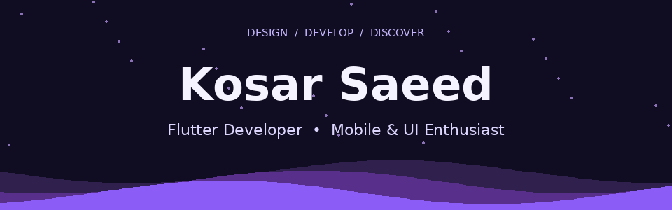
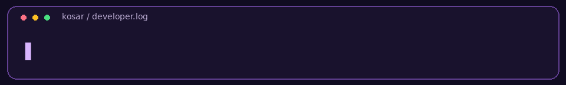
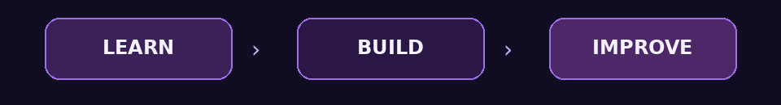

**[Portfolio](https://koasarsaeedss-bot.github.io) · [Email](mailto:koasarsaeedss@gmail.com) · [My repositories](https://github.com/koasarsaeedss-bot?tab=repositories) · [Fiverr](https://www.fiverr.com/kosar_saeed)**

## 💜 About me

I'm **Kosar Saeed**, a second-year Computer Science student at **Mehran University of Engineering & Technology**. I enjoy building mobile apps and creating interfaces that are easy to use.

- 📱 Building with **Flutter, Dart & Firebase**.
- ☕ Strengthening my **Java, OOP & DSA** skills.
- 🎨 Exploring **mobile UI and UI/UX design**.
- 🌱 Learning through practice and real-world projects.

## 🛠️ My toolkit

| Area | Technologies |
|:---|:---|
| Mobile development | **Flutter · Dart · Firebase** |
| Programming | **Java · C++** |
| Databases | **MySQL · MongoDB** |
| Tools | **Git · GitHub · VS Code · Android Studio** |

## 🚀 Featured projects

| Project | What it does | Built with |
|:---|:---|:---|
| 🩸 **Blood Donor Tracking System** | Manages blood donors and blood requests through a desktop interface. | Java · Swing · MySQL |
| 📊 **Student Grade Management** | Tracks grades, calculates GPA and generates reports. | C++ · File I/O |
| 📱 **Flutter App** · Coming soon | A cross-platform mobile app with a Firebase backend. | Flutter · Dart · Firebase |

**[Explore all my repositories →](https://github.com/koasarsaeedss-bot?tab=repositories)**

## 🌱 Learning journey

| Strengthening | Exploring | Building |
|:---|:---|:---|
| Java & DSA | System design principles | Flutter apps |
| Object-oriented programming | Firebase features | Portfolio projects |
| Clean code practices | UI/UX design patterns | Open-source contributions |

## 📬 Let's connect

Interested in mobile apps, thoughtful interfaces or learning together? **Let's connect.**

- **Portfolio:** [koasarsaeedss-bot.github.io](https://koasarsaeedss-bot.github.io)
- **Email:** [koasarsaeedss@gmail.com](mailto:koasarsaeedss@gmail.com)
- **Fiverr:** [kosar_saeed](https://www.fiverr.com/kosar_saeed)

---

**Thanks for visiting. Keep creating. Keep learning. 💜**

*Made with curiosity, code and a little purple.*

